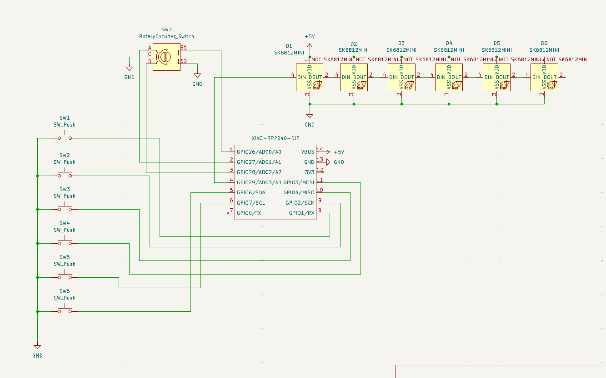
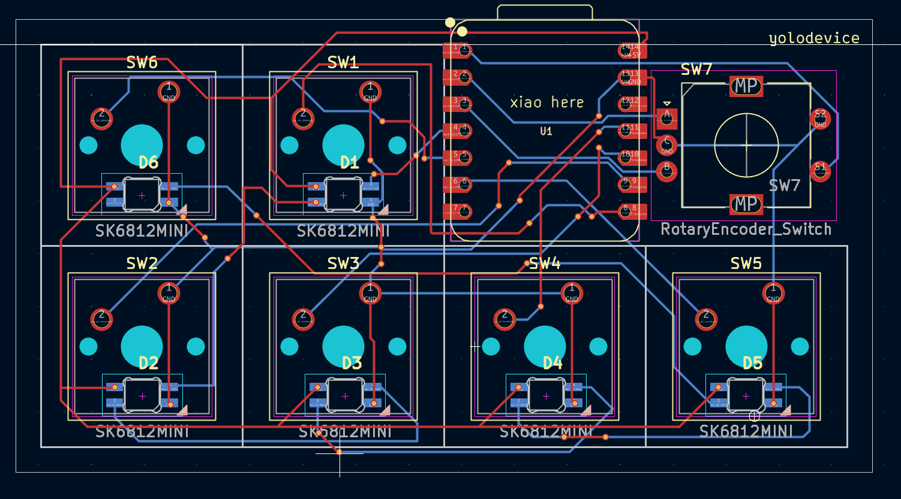
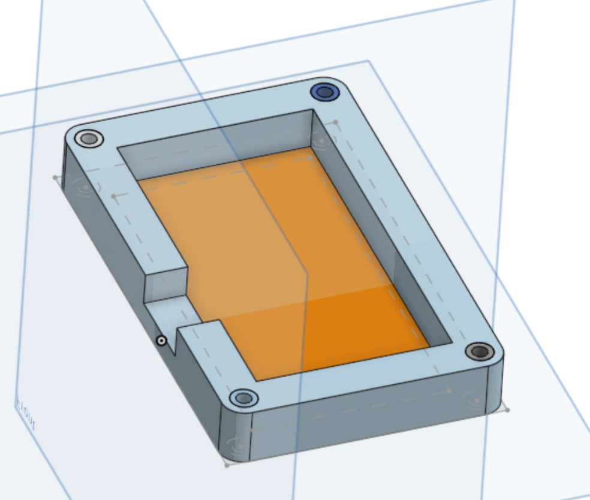
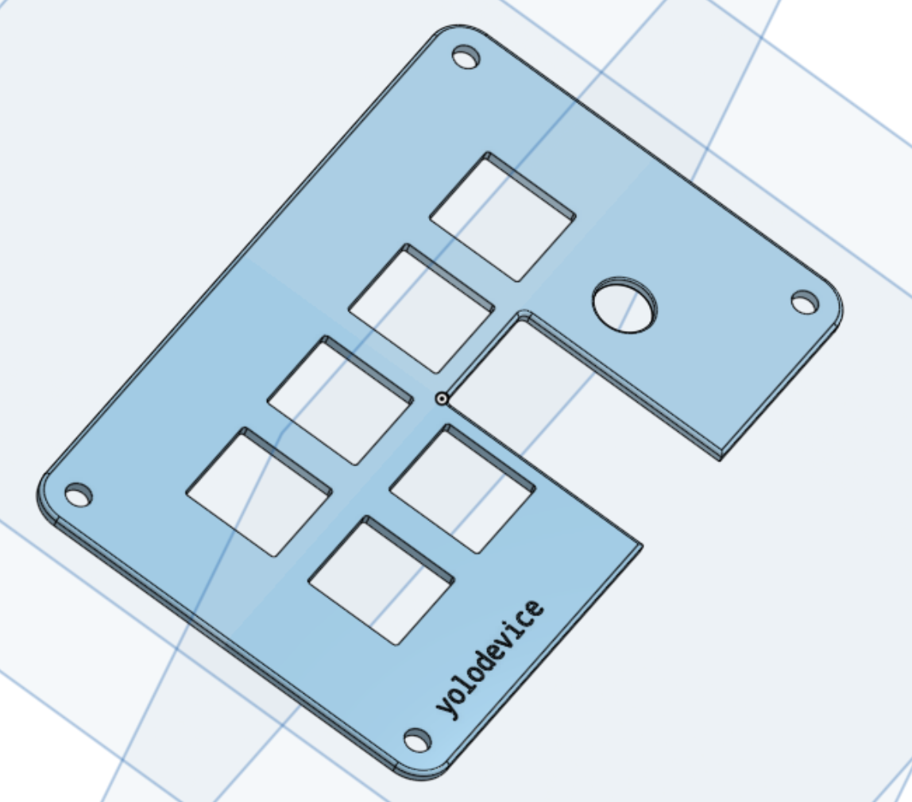
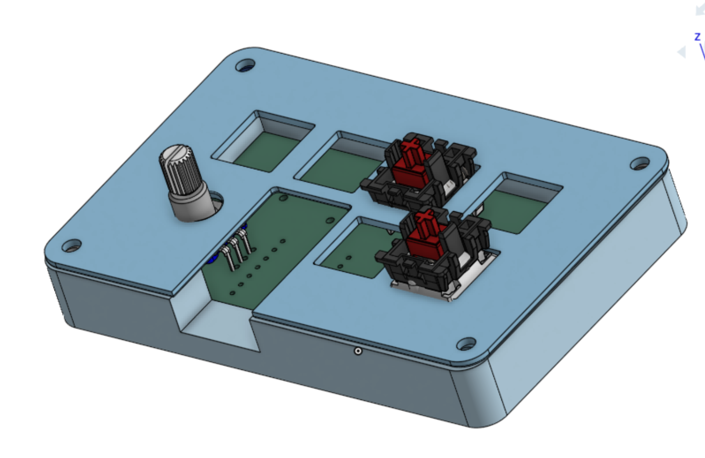

# Yolodevice
A macropad device with 6 keys and 1 knob, powered by a RP2040 using QMK. The design was inspired by the Sayodevice, but I removed the screen in favor of having more keys.

## Showcase
### Schematic

### PCB

### Case

### Overall

*Note: sorry for the scuffedness, I have no clue how to neatly assemble things with Onshape*

## BOM
 - 6x Cherry MX Switches
 - 6x SK6812 MINI Leds
 - 1x XIAO RP2040
 - 6x Blank DSA Keycaps
 - 4x M3x16 Bolt
 - 4x M3 Heatset
 - 1x EC11 Rotary Encoder
